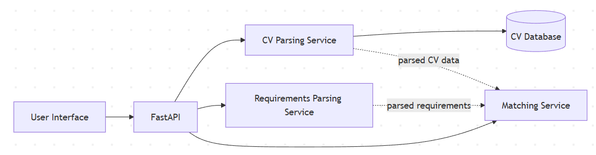

# Proposal

Optimierung des bestehenden Studienprojekts als Cloud-Anwendung mit Micro-Services.

---

## Studienprojekt – CV-Matcher

### Einführung

Unser Studienprojekt ist eine Kooperation mit **Trescon** und beschäftigt sich mit der maschinellen Bewertung von Lebensläufen.  
Dabei werden Lebensläufe mit Anforderungsdokumenten verglichen, welche den/die ideale/n Kandidat/in für eine Stelle beschreiben. Ziel ist es, passende Kandidat*innen effizient zu identifizieren.

Es wurde mit Trescon bereits abgeklärt, dass dieses Studienprojekt in diesem Rahmen verwendet werden darf.

---

## Methodik

Lebensläufe und Anforderungsdokumente werden mithilfe eines **Large Language Models (LLM)** geparst und in ein maschinenlesbares Format überführt (JSON mit vordefinierter Struktur).  
Die geparsten Lebensläufe werden anschließend in einer Datenbank gespeichert.

Für die weitere Verarbeitung und Bewertung wurden mehrere Methoden entwickelt:

- **Vergleich über Embeddings**  
  Cosine Similarity misst die Ähnlichkeit zwischen Lebenslauf und Anforderungsdokument

- **ESCO-Ontologie**  
  Die ESCO-Ontologie beschreibt Berufe und Fähigkeiten.  
  ESCO-Terme aus dem Anforderungsdokument werden im Lebenslauf gesucht.  
  Ein Score gibt an, wie viele dieser Begriffe abgedeckt sind.

- **Vergleich mit LLM**  
  Lebenslauf und Anforderungsdokument werden gemeinsam an das LLM übergeben, das einen sprachlich erklärten Score erzeugt.

---

## Aktuelle Architektur

Die derzeitige Systemarchitektur besteht aus zwei getrennten Schichten (Frontend und Backend), die beide mit Python implementiert wurden und mittels FastAPI kommunizieren. Beide Komponenten werden gemeinsam in einem Docker Container betrieben. Die Anwendung ist derzeit für den lokalen Betrieb ausgelegt. Die Ausführung des integrierten Large Language Models erfolgt GPU-beschleunigt und wird über Ollama angebunden. Die Entscheidung für das lokale LLM verlief vor allem aufgrund der Datenschutzverordnung, um reale Kundendaten von TRESCON verwenden zu dürfen. Dieser Sicherheitsaspekt soll im gesamten Projekt beachtet werden.

Zurzeit werden die geparsten Lebensläufe als Dateien lokal gespeichert und der Dateipfad wird gemeinsam mit einem eindeutigen Hash in einer Datenbank abgelegt. Bei Upload eines Lebenslaufs wird mittels Hash überprüft ob dieser bereits in der Datenbank vorhanden ist, ansonsten wird er ebenfalls geparst und der Pfad wird in der Datenbank abgelegt.

---

## Neues Development

Im Rahmen dieses Projekts soll die bestehende Applikation in eine **Microservice-Architektur** überführt werden.

Geplante Microservices:

- UI-Service
- CV-Parsing-Service
- Requirements-Parsing-Service
- Matching-Service
- Database-Service

Alle Services sollen in **unabhängigen Docker-Containern** deployt werden.

Zusätzlich soll evaluiert werden, wie die Abfrage des LLMs in der **Cloud** ausgeführt werden kann, sodass keine lokalen Ressourcen (GPU) mehr benötigt werden.  Nach Möglichkeit soll diese Cloud-LLM-Lösung auch implementiert werden.

Besondere Schwerpunkte:
- Datensicherheit und Datenschutz
- Kostenoptimierung

---

## Architektur

---

## Cloud-Technologien

Für dieses Projekt wird **Google Cloud** verwendet.  
Es wurde eine eigene E-Mail-Adresse erstellt, über die alle Teilnehmerinnen Zugriff auf die Cloud-Ressourcen erhalten.  
Diese kann später auch an die Auftraggeber übergeben werden.

---

## Meilensteine und Arbeitsaufteilung

Es wurden drei zentrale Meilensteine definiert, für die jeweils eine Person verantwortlich ist:

---

### 1. Containerisierung & Service-Trennung  
**Verantwortlich:** Maja Nikolic

- Basis-Containerisierung  
  - Erstellung eigener Dockerfiles für jeden Service
- Orchestrierung  
  - Gemeinsamer Betrieb aller Services im Entwicklungsumfeld

---

### 2. Datenhaltung in Cloud-Datenbank  
**Verantwortlich:** Sigrid Klein

- Datenmodellierung  
  - Speichern von Original-Lebensläufen (pdf) und geparsten Lebensläufen (json)
  - Herstellen der Verbindung zwischen pdf und json
- Datenbank-Setup in der Cloud mit Hilfe von Google Cloud Storage
- Integration in die Microservices unter Einhaltung der DSGVO
  - Eigener Microservice: Data-Access-Service

---

### 3. LLM to Cloud  
**Verantwortlich:** Nina Schellner

- Ist-Analyse der aktuellen LLM-Implementierung
- Datenschutz- und Sicherheitsbewertung der Google-Cloud-LLM-Lösung
- Optional: Prototypische Integration in die bestehende Applikation

