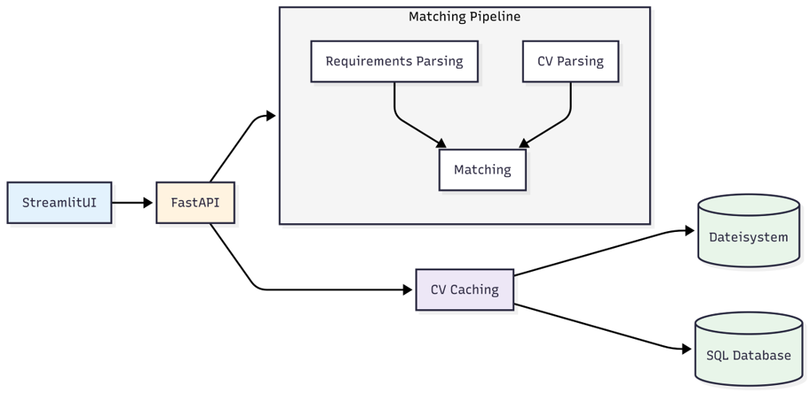
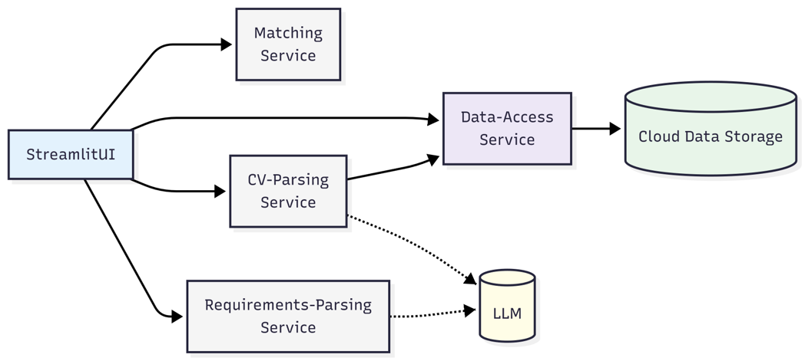

# CLC3-Projekt: Microservice-Architektur für CVMatcher

Im Rahmen dieses Projekts wurde eine bestehende Python-Anwendung bestehend aus Streamlit-Frontend und FastAPI-Backend in eine containerisierte Microservice-Architektur überführt. Ziel war es, die Anwendung modularer, robuster und skalierbarer zu gestalten.


# Applikation starten
## .env File modifizieren
Das -env File konfiguriert den Pfad zu den Google Cloud Credentials. Dieser Pfad muss individuell angepasst werden und zu Credentials führen die Berechtigung für den Zugriff zu den entsprechenden Google Cloud Storage Buckets haben.

## docker compose build
Der Command "docker compose build" baut den Docker Container mit allen Microservices. Dazu muss Docker Desktop aktiv sein.

## docker compose up
Der Command "docker compose up" startet die Applikation. Sie ist nun auf http://localhost:8501/ erreichbar

---


## Studienprojekt – CV-Matcher

### Einführung

Unser Studienprojekt ist eine Kooperation mit **Trescon** und beschäftigt sich mit der maschinellen Bewertung von Lebensläufen.  
Dabei werden Lebensläufe mit Anforderungsdokumenten verglichen, welche den/die ideale/n Kandidat/in für eine Stelle beschreiben. Ziel ist es, passende Kandidat*innen effizient zu identifizieren.

Es wurde mit Trescon bereits abgeklärt, dass dieses Studienprojekt in diesem Rahmen verwendet werden darf.

---

## Methodik

Lebensläufe und Anforderungsdokumente werden mithilfe eines **Large Language Models (LLM)** geparst und in ein maschinenlesbares Format überführt (JSON mit vordefinierter Struktur).  
Die geparsten Lebensläufe werden anschließend in einer Datenbank gespeichert.

Für die weitere Verarbeitung und Bewertung wurden mehrere Methoden entwickelt:

- **Vergleich über Embeddings**  
  Cosine Similarity misst die Ähnlichkeit zwischen Lebenslauf und Anforderungsdokument

- **ESCO-Ontologie**  
  Die ESCO-Ontologie beschreibt Berufe und Fähigkeiten.  
  ESCO-Terme aus dem Anforderungsdokument werden im Lebenslauf gesucht.  
  Ein Score gibt an, wie viele dieser Begriffe abgedeckt sind.

- **Vergleich mit LLM**  
  Lebenslauf und Anforderungsdokument werden gemeinsam an das LLM übergeben, das einen sprachlich erklärten Score erzeugt.

---

## Ausgangssituation

Die derzeitige Systemarchitektur besteht aus zwei getrennten Schichten (Frontend und Backend), die beide mit Python implementiert wurden und mittels FastAPI kommunizieren. Beide Komponenten werden gemeinsam in einem Docker Container betrieben. Die Anwendung ist derzeit für den lokalen Betrieb ausgelegt. Die Ausführung des integrierten Large Language Models erfolgt GPU-beschleunigt und wird über Ollama angebunden. Die Entscheidung für das lokale LLM verlief vor allem aufgrund der Datenschutzverordnung, um reale Kundendaten von TRESCON verwenden zu dürfen. Dieser Sicherheitsaspekt soll im gesamten Projekt beachtet werden.

Zurzeit werden die geparsten Lebensläufe als Dateien lokal gespeichert und der Dateipfad wird gemeinsam mit einem eindeutigen Hash in einer Datenbank abgelegt. Bei Upload eines Lebenslaufs wird mittels Hash überprüft ob dieser bereits in der Datenbank vorhanden ist, ansonsten wird er ebenfalls geparst und der Pfad wird in der Datenbank abgelegt.



---

## Neues Deployment

Im Rahmen dieses Projekts wurde die bestehende Applikation in eine **Microservice-Architektur** überführt, wobei folgende Microservices umgesetzt wurden

- UI-Service
- CV-Parsing-Service
- Requirements-Parsing-Service
- Matching-Service
- DataAccess-Service

Alle Services laufen in separaten Docker-Containern und kommunizieren über das interne Docker-Netzwerk mittels HTTP. Die Netzwerkverwaltung und Orchestierung wird von Docker Compose übernommen.




Zusätzlich soll evaluiert werden, wie die Abfrage des LLMs in der **Cloud** ausgeführt werden kann, sodass keine lokalen Ressourcen (GPU) mehr benötigt werden.  Nach Möglichkeit soll diese Cloud-LLM-Lösung auch implementiert werden.

Besondere Schwerpunkte:
- Datensicherheit und Datenschutz
- Kostenoptimierung

---


## Cloud-Technologien

Für dieses Projekt wird **Google Cloud** verwendet.  
Es wurde eine eigene E-Mail-Adresse erstellt, über die alle Teilnehmerinnen Zugriff auf die Cloud-Ressourcen erhalten.  
Diese kann später auch an die Auftraggeber übergeben werden.

---

## Lessons-learned

### Internes Docker-Netzwerk
* **Container-Isolation:** ```localhost``` gilt nur innerhalb eines Containers, keine direkte Kommunikation zwischen Services über ```localhost```.
* **Service-Namen nutzen:** Kommunikation zwischen Microservices muss über die Docker-Service-Namen erfolgen (cv-parsing-service:8000 etc.).
* **Server auf 0.0.0.0 binden:** Nur so sind Services im Docker-internen Netzwerk sichtbar und für andere Container erreichbar.